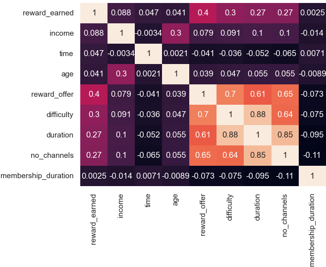
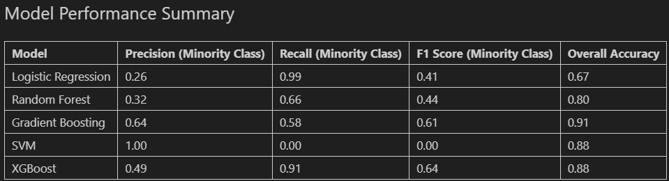

# Starbucks Capstone Project

## Executive Summary
This report presents the results of a machine learning project aimed at predicting offer completion rates. Key insights include:
- Gradient Boosting emerged as the most balanced model for addressing class imbalance.
- Feature importance analysis highlights that timing and offer duration significantly impact completion rates.
- Actionable strategies, such as optimizing offer timing and simplifying offers, are proposed.

## Introduction
### Problem Statement
Offer completion rates are critical for optimizing marketing strategies. However, class imbalance in datasets makes it challenging to predict successful offer completions accurately.

### Objectives
1. Predict offer completion using machine learning models.
2. Identify key factors influencing completion rates.
3. Propose actionable strategies based on findings.

### Business Relevance
Improving offer completion rates can increase customer engagement and ROI for marketing campaigns.

## Data Overview
### Datasets Used
| Dataset      | Description                                          |
|--------------|------------------------------------------------------|
| **Portfolio**| Contains offer details (e.g., type, duration, reward).|
| **Profile**  | Includes customer demographics (e.g., age, income, gender).|
| **Transcript** | Tracks offer events (e.g., received, completed) and transaction data.|

### Preprocessing Steps
- Handled missing values (e.g., imputed `reward_earned` as 0).
- Engineered features like binary channel columns and `offer_completed`.

### Exploratory Data Analysis

## Methodology
### Feature Selection
Features included:
- **Continuous:** time, duration, difficulty.
- **Categorical:** offer_type, age_cat, gender.

### Models Used
1. Logistic Regression
2. Random Forest
3. Gradient Boosting
4. Support Vector Machine (SVM)
5. XGBoost

### Evaluation Metrics
Metrics used:
- Accuracy: For overall correctness.
- F1-Score: Balancing precision and recall.
- Precision: To measure false positives.
- Recall: To measure false negatives.

## Results

| Model              | Precision (Minority Class) | Recall (Minority Class) | F1 Score (Minority Class) | Overall Accuracy |
|--------------------|---------------------------|-------------------------|--------------------------|------------------|
| Logistic Regression| 0.26                      | 0.99                    | 0.41                     | 0.67             |
| Random Forest      | 0.32                      | 0.66                    | 0.44                     | 0.80             |
| Gradient Boosting  | 0.64                      | 0.58                    | 0.61                     | 0.91             |
| SVM                | 1.00                      | 0.00                    | 0.00                     | 0.88             |
| XGBoost            | 0.49                      | 0.91                    | 0.64                     | 0.88             |

## Discussion and Insights
### Key Observations
- Gradient Boosting delivers the best balance between precision and recall for minority class predictions.
- Time and duration significantly influence offer completion rates, emphasizing the importance of behavioral over demographic targeting.

### Limitations
- Class imbalance remains a challenge.
- SVM failed to identify minority class instances effectively.

## Recommendations
### Short-Term Actions
- Deploy Gradient Boosting predictions for the next campaign.
- Optimize offer timing based on activity patterns.

### Long-Term Strategies
- Refine models using advanced sampling techniques.
- Explore temporal patterns (e.g., seasonal trends).

## Conclusion
Gradient Boosting emerged as the most effective model for addressing class imbalance and predicting offer completion. Key recommendations include optimizing offer timing and simplifying offers for better customer engagement.

## References
- [Scikit-learn Documentation](https://scikit-learn.org/)
- [Dataset Source](https://github.com/CoskunErden/Udacity_DS_Capstone_Project)
