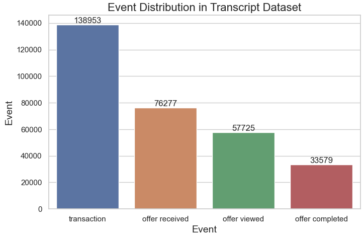
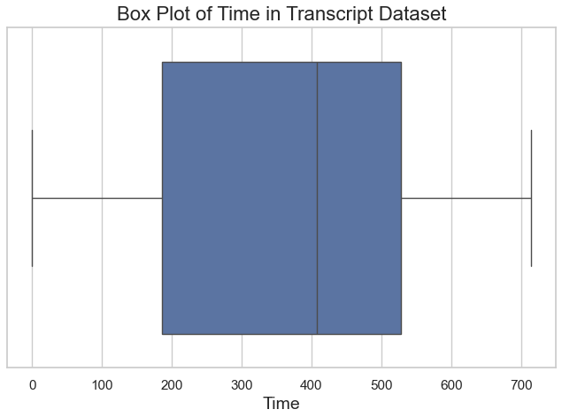
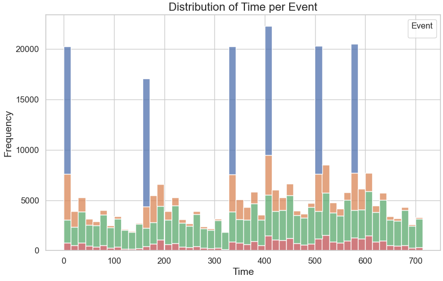
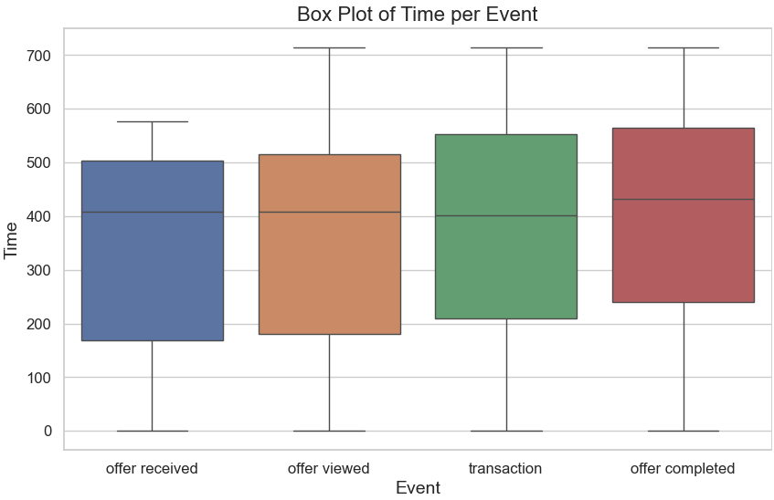
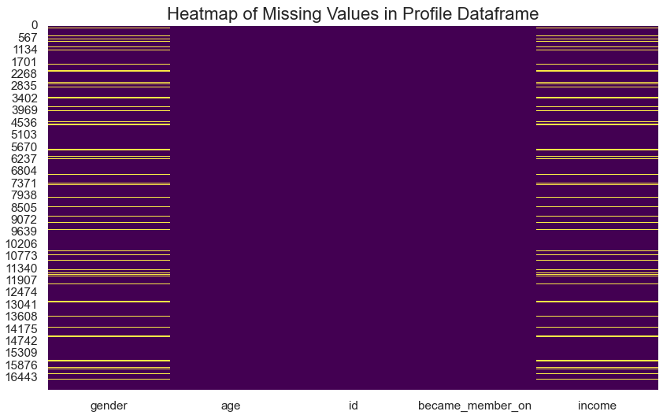
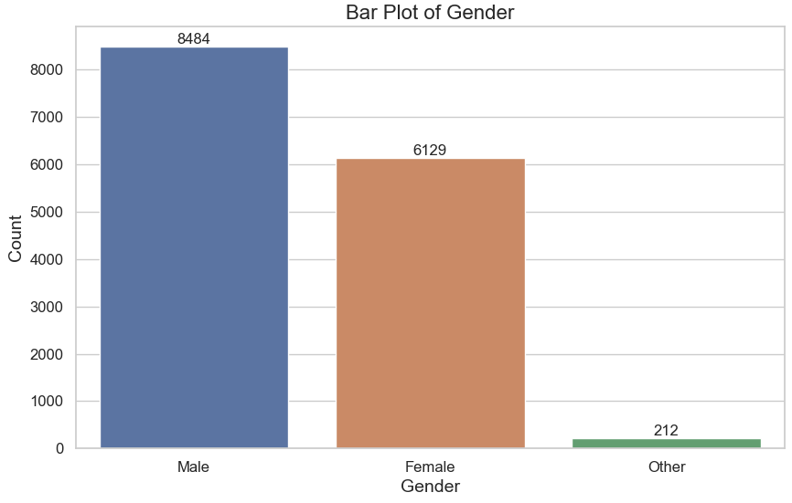
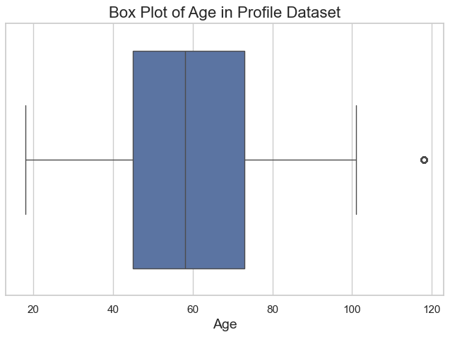
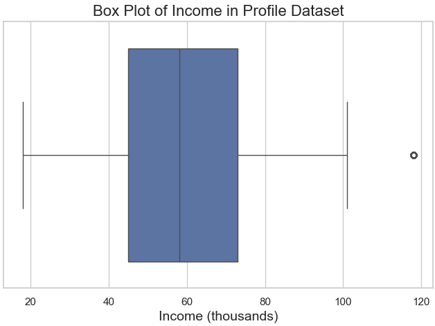
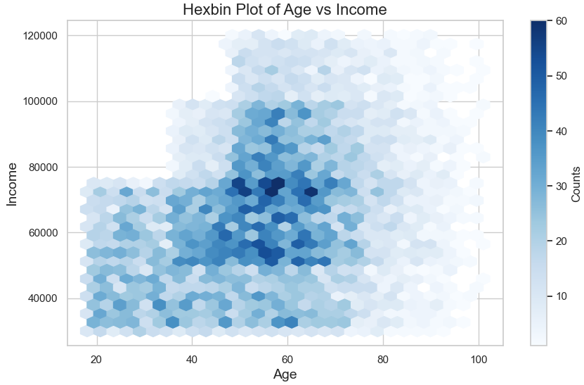
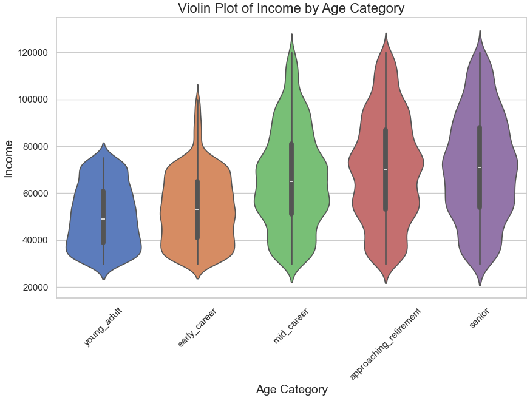

# Starbucks Capstone Project

**Author:** Coskun Erden  
**Date:** 11/27/2024  

---

## Executive Summary  
This project focuses on the Starbucks Capstone Challenge, which simulates customer purchasing decisions influenced by promotional offers. The challenge explores how machine learning models can predict offer completion rates and provide actionable strategies to optimize marketing performance.  

- **Best Model:** Gradient Boosting, achieving an accuracy of 91% and an F1-Score of 0.61 for the minority class.  
- **Key Insights:** Behavioral factors such as timing and offer duration significantly influence completion rates, while demographic attributes like age and gender have a minimal effect.  
- **Actionable Strategies:** Recommendations include simplifying offers, targeting high-value customers, and leveraging multi-channel communication to maximize engagement.  

---

## Project Overview  

### Background  
Promotional offers are a cornerstone of marketing strategies, designed to boost customer engagement and increase sales. However, their effectiveness often depends on how well they resonate with customers. This project aims to optimize these campaigns by identifying which offers work best for different customer groups and developing a data-driven approach to improve offer completion rates.  

### Datasets  
The analysis relies on three key datasets:  

1. **Profile Dataset:**  
   - **Size:** 17,000 users  
   - **Attributes:** Age, gender, income, and membership start date  

2. **Portfolio Dataset:**  
   - **Size:** 10 promotional offers  
   - **Attributes:** Offer type, reward, difficulty, duration, and delivery channels  

3. **Transcript Dataset:**  
Here’s how we can adjust and expand the explanation for your blog:

---

### Dataset Overview: `transcript`

The `transcript` dataset forms a critical component of the analysis by documenting customer interactions with promotional offers. It contains **306,534 entries** and four key columns:

- **`person`**: Represents a unique customer ID.
- **`event`**: Describes the type of interaction, such as `offer received`, `offer viewed`, or `transaction`.
- **`value`**: Stores additional details as a dictionary. For instance, it can include the offer ID for promotional events or the transaction amount for purchases.
- **`time`**: Records the time of the interaction in hours since the start of the test.

Notably, the dataset is complete, with no missing values, ensuring consistency in analysis.

---

### Why This Dataset Matters

This dataset provides a detailed timeline of customer behavior, offering insights into how customers engage with promotions and make transactions. By analyzing the `transcript`, we can uncover trends in offer effectiveness and customer preferences.

---

### Sample Data

Here’s a snapshot of the dataset for better understanding:

| **person**       | **event**       | **value**                                   | **time** |
|-------------------|-----------------|---------------------------------------------|----------|
| 78afa995795e4d85 | offer received  | {"offer_id": "ae264e3637204a6fb9bb56bc8210ddfd"} | 0        |
| 78afa995795e4d85 | offer viewed    | {"offer_id": "ae264e3637204a6fb9bb56bc8210ddfd"} | 6        |
| 78afa995795e4d85 | transaction     | {"amount": 9.64}                           | 12       |

The `value` column is particularly noteworthy for its nested structure, requiring parsing to extract meaningful details for further analysis.

---

### Key Observations

Observations
1. Distribution of Events

Transactions are the most common event, with 138,953 occurrences, indicating frequent customer purchases or monetary interactions.
Offer received events follow with 76,277 occurrences, suggesting widespread distribution of promotional offers.
Offer viewed and offer completed events are less frequent (57,725 and 33,579, respectively), indicating a gap between receiving offers and acting on them.

2. Time Analysis
The time column has:
Mean: 366 hours
Median: 408 hours
Range: 0 to 714 hours
A box plot of time (below) shows no extreme outliers, with data evenly distributed over the 714-hour range.

3. Event Timing Distribution
The histogram (below) reveals:
Peaks in offer received events occur at regular intervals, suggesting scheduled distributions.
Offer viewed and offer completed events are spread more consistently, indicating customer engagement over time.

4. Box Plot by Event
The box plot (below) indicates:
Offer received and offer viewed events have similar time ranges.
Transactions and offer completed events show slightly broader distributions, reflecting more variability in customer responses.

By breaking down and preprocessing this dataset, we can generate valuable insights into customer engagement patterns.

---

Here’s a structured summary that you can add to your `index.md` for the portfolio dataset, following the style used for the transcript dataset:

---

## Portfolio Dataset

The `portfolio` dataset contains 10 unique promotional offers, each with details on the **reward amount**, **distribution channels**, **difficulty level**, **duration**, **offer type**, and an **identifier**.

### Key Observations

1. **Reward Amount**:
   - Unique values: `10`, `5`, `3`, `2`, and `0`.
   - Indicates a range of incentives, with larger rewards likely targeting more significant customer engagement.

2. **Difficulty Level**:
   - Unique values: `20`, `10`, `7`, `5`, and `0`.
   - Reflects the spending thresholds customers need to meet to qualify for the reward.

3. **Duration**:
   - Ranges from `3` to `10` days, with a mean of `6.5`.
   - Indicates the time period customers have to engage with the promotional offer.

4. **Channels**:
   - Offers are distributed across platforms, including **email**, **mobile**, **web**, and **social** media.

5. **Offer Types**:
   - Includes **BOGO** (buy-one-get-one), **discount**, and **informational** offers.

### Statistical Summary

The `portfolio.describe()` output provides the following statistical summary:

| Metric       | Reward | Difficulty | Duration |
|--------------|--------|------------|----------|
| **Count**    | 10     | 10         | 10       |
| **Mean**     | 4.2    | 7.7        | 6.5      |
| **Std Dev**  | 3.5    | 5.8        | 2.3      |
| **Min**      | 0      | 0          | 3        |
| **25%**      | 0      | 5          | 5        |
| **50%**      | 4      | 8.5        | 7        |
| **75%**      | 5      | 10         | 7        |
| **Max**      | 10     | 20         | 10       |

### Additional Information

- The dataset combines promotional strategies with varying rewards, difficulties, and durations to target diverse customer segments.
- Channels such as **email**, **mobile**, and **web** are utilized to increase reach and engagement.

---
### Profile Dataset Overview

The `profile` dataset provides demographic and membership information for 17,000 customers. It contains five columns that help analyze customer characteristics and their potential influence on marketing strategies. Below is a summary of the dataset:

---

#### **Key Columns**
1. **`gender`**: Gender of the customer. 
   - Values: Male, Female, Other
   - Missing: 2,175 entries

2. **`age`**: Age of the customer.
   - Range: 18 to 118 (118 is likely a placeholder for missing values)
   - Median: 58 years

3. **`id`**: Unique identifier for each customer.
   - Example: "68be06ca..."; no missing values.

4. **`became_member_on`**: Date when the customer joined, formatted as `YYYYMMDD`.
   - Example: 20170715; no missing values.

5. **`income`**: Annual income of the customer (in dollars).
   - Range: $30,000 to $120,000
   - Missing: 2,175 entries

---

#### **Exploration Highlights**
1. **Missing Data**:
   - Missing values are found in `gender` and `income`.
   - A **heatmap** was used to visualize the distribution of missing data.

2. **Gender Distribution**:
   - Majority of customers are Male (8,484) and Female (6,129), with a small proportion (212) categorized as "Other."
   - A **bar plot** illustrates this distribution, highlighting a slight gender imbalance favoring males.

3. **Age Distribution**:
   - The **box plot** of `age` shows the median is 58 years, with an interquartile range of 45 to 73 years.
   - Ages were divided into categories (e.g., Young Adult, Mid Career) using bins for better segmentation.

4. **Income Distribution**:
   - The **box plot** of `income` shows most customers earn between $50,000 and $75,000, with a few high-income outliers.
   - A **violin plot** of `income` by age category reveals that Mid Career customers tend to have the highest earnings.

5. **Correlation Between Age and Income**:
   - A **hexbin plot** demonstrates the relationship between age and income, showing a peak in earnings during Mid Career and a gradual decline afterward.

6. **Violin Plot Analysis of Age and Income**

The violin plot provides a detailed visualization of **income distribution** across different **age categories** in the `profile` dataset. Each violin shape represents an age group, with the width of the plot indicating the density of income values within that group. The median income values are marked by white dots inside the violins, and the spread of data is captured by the shape.

---

**Insights from the Violin Plot**
1. **Young Adult (18-25)**:
   - Narrow income range.
   - Median income is lower compared to other age groups.
   - Indicates that customers in this category are likely early in their careers or financially dependent.

2. **Early Career (25-40)**:
   - Wider distribution than Young Adults.
   - Slight increase in median income, signaling career progression.

3. **Mid Career (40-55)**:
   - The widest income spread among all categories.
   - Highest median income, reflecting peak earning years.
   - Suitable target group for higher-value promotions.

4. **Approaching Retirement (55-70)**:
   - Narrower spread compared to Mid Career but with a relatively high median income.
   - Financial stability in this group could make them receptive to specific marketing strategies.

5. **Senior (70+)**:
   - The narrowest spread of income.
   - Slight decline in median income, likely due to retirement.
   - Marketing strategies should focus on fixed-income demographics.

---

#### **Key Takeaways**
- **Targeting Opportunities**:
  - The Mid Career group offers the most potential for high-value campaigns due to their financial capacity and income variability.
  - Tailored marketing for Early Career customers could address their growing financial independence.
  - Seniors may respond better to promotions catering to their financial stability.

- **Strategic Insights**:
  - Age and income are highly correlated, with income peaking during the Mid Career years and stabilizing or declining afterward.
  - This visualization helps identify customer segments based on financial capacity and their likelihood to engage with different promotional offers.

The violin plot highlights the importance of segmenting customers by age and income to design effective marketing strategies tailored to their financial profiles.
---

#### **Insights**
- Customers in their Mid Career (40-55 years) tend to earn more and are likely key targets for high-value campaigns.
- Gender imbalance and missing income data should be addressed for more comprehensive insights.
- Membership trends can be analyzed using the `became_member_on` column to identify periods of high customer acquisition.

The `profile` dataset provides foundational insights into customer demographics, enabling the development of targeted marketing strategies and personalized campaigns.
## Data Preparation  

### Preprocessing  
1. **Handling Missing Values:**  
   - **Gender:** Replaced missing values with "Unknown"  
   - **Age:** Imputed median values for ages encoded as 118  
   - **Reward Earned:** Set to 0 for events without rewards  

2. **Feature Engineering:**  
   - **Channel Indicators:** Created binary variables for delivery channels (web, email, mobile, social)  
   - **Age Categories:** Grouped ages into bins such as 'Young Adult,' 'Mid-Career,' and 'Senior'  
   - **Offer Completed:** Added a binary indicator for successful offer completions  

3. **Scaling and Encoding:**  
   - Normalized continuous variables such as income and duration using StandardScaler  
   - One-hot encoded categorical features like gender and offer type  

### Exploratory Data Analysis  
- **Correlations:**  

  Timing and duration exhibited strong correlations with offer completion rates. Longer durations and well-timed offers are more likely to succeed.  

- **Event Analysis:**  
  A significant drop-off was observed between offers viewed and completed, highlighting areas for optimization.  

- **Demographic Trends:**  
  - Gender distribution was nearly even, with males completing slightly more discount offers.  
  - Customers in the 'Mid-Career' age group demonstrated higher completion rates.  

---

## Methodology  

### Feature Selection  
Key features included:  
- **Continuous:** Time, duration, difficulty, income  
- **Categorical:** Offer type, age categories, gender, channel indicators  

### Models Evaluated  
1. **Logistic Regression:** A baseline model for comparison.  
2. **Random Forest:** Robust but less effective with imbalanced datasets.  
3. **Gradient Boosting:** Best performer with balanced metrics.  
4. **SVM:** Struggled with class imbalance.  
5. **XGBoost:** Strong alternative with high recall.  

### Evaluation Metrics  
1. **Accuracy:** Measures overall correctness but can be misleading in imbalanced datasets.  
2. **F1-Score:** Balances precision and recall, critical for the minority class.  
3. **Precision & Recall:** Evaluate false positives and negatives, respectively.  

---

## Results  

### Model Performance  

### Insights  
1. Gradient Boosting achieved the best balance between precision, recall, and F1-Score, making it ideal for handling class imbalance.  
2. Timing and duration emerged as the most important factors influencing offer completion.  

---

## Recommendations  

### Short-Term Actions  
1. Deploy Gradient Boosting predictions for upcoming campaigns.  
2. Simplify offers to reduce difficulty levels and extend durations.  
3. Optimize timing based on customer activity patterns.  

### Long-Term Strategies  
1. Incorporate advanced sampling techniques like SMOTE to address class imbalance.  
2. Develop dynamic recommendation systems for personalized offer targeting.  
3. Analyze seasonal trends to align campaigns with peak activity periods.  

---

## Conclusion  
This project demonstrates the effectiveness of using machine learning to enhance marketing strategies. By focusing on behavioral insights and deploying Gradient Boosting, businesses can improve offer completion rates and achieve higher ROI. Future efforts should explore advanced techniques like dynamic personalization and external data integration to refine predictions further.  

---

## References  
- [Scikit-learn Documentation](https://scikit-learn.org/)  
- [Dataset Source](https://github.com/CoskunErden/Udacity_DS_Capstone_Project)  

---