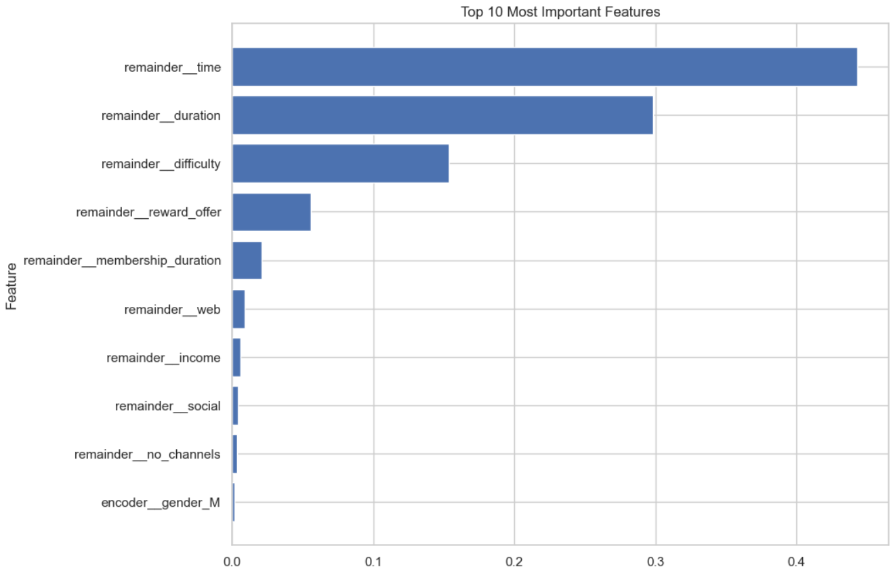

# Starbucks Capstone Project

**Author:** Coskun Erden  
**Date:** 11/27/2024  

---

## Executive Summary  
This project focuses on the Starbucks Capstone Challenge, which simulates customer purchasing decisions influenced by promotional offers. The challenge explores how machine learning models can predict offer completion rates and provide actionable strategies to optimize marketing performance.  

- **Best Model:** Gradient Boosting, achieving an accuracy of 91% and an F1-Score of 0.61 for the minority class.  
- **Key Insights:** Behavioral factors such as timing and offer duration significantly influence completion rates, while demographic attributes like age and gender have a minimal effect.  
- **Actionable Strategies:** Recommendations include simplifying offers, targeting high-value customers, and leveraging multi-channel communication to maximize engagement.  

---

## Project Overview  

### Background  
Promotional offers are a cornerstone of marketing strategies, designed to boost customer engagement and increase sales. However, their effectiveness often depends on how well they resonate with customers. This project aims to optimize these campaigns by identifying which offers work best for different customer groups and developing a data-driven approach to improve offer completion rates.  

### Datasets  
The analysis relies on three key datasets:  

1. **Profile Dataset:**  
   - **Size:** 17,000 users  
   - **Attributes:** Age, gender, income, and membership start date  

2. **Portfolio Dataset:**  
   - **Size:** 10 promotional offers  
   - **Attributes:** Offer type, reward, difficulty, duration, and delivery channels  

3. **Transcript Dataset:**  
Here’s how we can adjust and expand the explanation for your blog:

---

### Dataset Overview: `transcript`

The `transcript` dataset forms a critical component of the analysis by documenting customer interactions with promotional offers. It contains **306,534 entries** and four key columns:

- **`person`**: Represents a unique customer ID.
- **`event`**: Describes the type of interaction, such as `offer received`, `offer viewed`, or `transaction`.
- **`value`**: Stores additional details as a dictionary. For instance, it can include the offer ID for promotional events or the transaction amount for purchases.
- **`time`**: Records the time of the interaction in hours since the start of the test.

Notably, the dataset is complete, with no missing values, ensuring consistency in analysis.

---

### Why This Dataset Matters

This dataset provides a detailed timeline of customer behavior, offering insights into how customers engage with promotions and make transactions. By analyzing the `transcript`, we can uncover trends in offer effectiveness and customer preferences.

---

### Sample Data

Here’s a snapshot of the dataset for better understanding:

| **person**       | **event**       | **value**                                   | **time** |
|-------------------|-----------------|---------------------------------------------|----------|
| 78afa995795e4d85 | offer received  | {"offer_id": "ae264e3637204a6fb9bb56bc8210ddfd"} | 0        |
| 78afa995795e4d85 | offer viewed    | {"offer_id": "ae264e3637204a6fb9bb56bc8210ddfd"} | 6        |
| 78afa995795e4d85 | transaction     | {"amount": 9.64}                           | 12       |

The `value` column is particularly noteworthy for its nested structure, requiring parsing to extract meaningful details for further analysis.

---

### Key Observations

Observations
1. Distribution of Events

Transactions are the most common event, with 138,953 occurrences, indicating frequent customer purchases or monetary interactions.
Offer received events follow with 76,277 occurrences, suggesting widespread distribution of promotional offers.
Offer viewed and offer completed events are less frequent (57,725 and 33,579, respectively), indicating a gap between receiving offers and acting on them.

2. Time Analysis
The time column has:
Mean: 366 hours
Median: 408 hours
Range: 0 to 714 hours
A box plot of time (below) shows no extreme outliers, with data evenly distributed over the 714-hour range.

3. Event Timing Distribution
The histogram (below) reveals:
Peaks in offer received events occur at regular intervals, suggesting scheduled distributions.
Offer viewed and offer completed events are spread more consistently, indicating customer engagement over time.

4. Box Plot by Event
The box plot (below) indicates:
Offer received and offer viewed events have similar time ranges.
Transactions and offer completed events show slightly broader distributions, reflecting more variability in customer responses.

By breaking down and preprocessing this dataset, we can generate valuable insights into customer engagement patterns.

---

Here’s a structured summary that you can add to your `index.md` for the portfolio dataset, following the style used for the transcript dataset:

---

## Portfolio Dataset

The `portfolio` dataset contains 10 unique promotional offers, each with details on the **reward amount**, **distribution channels**, **difficulty level**, **duration**, **offer type**, and an **identifier**.

### Key Observations

1. **Reward Amount**:
   - Unique values: `10`, `5`, `3`, `2`, and `0`.
   - Indicates a range of incentives, with larger rewards likely targeting more significant customer engagement.

2. **Difficulty Level**:
   - Unique values: `20`, `10`, `7`, `5`, and `0`.
   - Reflects the spending thresholds customers need to meet to qualify for the reward.

3. **Duration**:
   - Ranges from `3` to `10` days, with a mean of `6.5`.
   - Indicates the time period customers have to engage with the promotional offer.

4. **Channels**:
   - Offers are distributed across platforms, including **email**, **mobile**, **web**, and **social** media.

5. **Offer Types**:
   - Includes **BOGO** (buy-one-get-one), **discount**, and **informational** offers.

### Statistical Summary

The `portfolio.describe()` output provides the following statistical summary:

| Metric       | Reward | Difficulty | Duration |
|--------------|--------|------------|----------|
| **Count**    | 10     | 10         | 10       |
| **Mean**     | 4.2    | 7.7        | 6.5      |
| **Std Dev**  | 3.5    | 5.8        | 2.3      |
| **Min**      | 0      | 0          | 3        |
| **25%**      | 0      | 5          | 5        |
| **50%**      | 4      | 8.5        | 7        |
| **75%**      | 5      | 10         | 7        |
| **Max**      | 10     | 20         | 10       |

### Additional Information

- The dataset combines promotional strategies with varying rewards, difficulties, and durations to target diverse customer segments.
- Channels such as **email**, **mobile**, and **web** are utilized to increase reach and engagement.

---
### Profile Dataset Overview

The `profile` dataset provides demographic and membership information for 17,000 customers. It contains five columns that help analyze customer characteristics and their potential influence on marketing strategies. Below is a summary of the dataset:

---

#### **Key Columns**
1. **`gender`**: Gender of the customer. 
   - Values: Male, Female, Other
   - Missing: 2,175 entries

2. **`age`**: Age of the customer.
   - Range: 18 to 118 (118 is likely a placeholder for missing values)
   - Median: 58 years

3. **`id`**: Unique identifier for each customer.
   - Example: "68be06ca..."; no missing values.

4. **`became_member_on`**: Date when the customer joined, formatted as `YYYYMMDD`.
   - Example: 20170715; no missing values.

5. **`income`**: Annual income of the customer (in dollars).
   - Range: $30,000 to $120,000
   - Missing: 2,175 entries

---

#### **Exploration Highlights**
1. **Missing Data**:
   - Missing values are found in `gender` and `income`.
   - A **heatmap** was used to visualize the distribution of missing data.

2. **Gender Distribution**:
   - Majority of customers are Male (8,484) and Female (6,129), with a small proportion (212) categorized as "Other."
   - A **bar plot** illustrates this distribution, highlighting a slight gender imbalance favoring males.

3. **Age Distribution**:
   - The **box plot** of `age` shows the median is 58 years, with an interquartile range of 45 to 73 years.
   - Ages were divided into categories (e.g., Young Adult, Mid Career) using bins for better segmentation.

4. **Income Distribution**:
   - The **box plot** of `income` shows most customers earn between $50,000 and $75,000, with a few high-income outliers.
   - A **violin plot** of `income` by age category reveals that Mid Career customers tend to have the highest earnings.

5. **Correlation Between Age and Income**:
   - A **hexbin plot** demonstrates the relationship between age and income, showing a peak in earnings during Mid Career and a gradual decline afterward.

6. **Violin Plot Analysis of Age and Income**

The violin plot provides a detailed visualization of **income distribution** across different **age categories** in the `profile` dataset. Each violin shape represents an age group, with the width of the plot indicating the density of income values within that group. The median income values are marked by white dots inside the violins, and the spread of data is captured by the shape.

---

**Insights from the Violin Plot**
1. **Young Adult (18-25)**:
   - Narrow income range.
   - Median income is lower compared to other age groups.
   - Indicates that customers in this category are likely early in their careers or financially dependent.

2. **Early Career (25-40)**:
   - Wider distribution than Young Adults.
   - Slight increase in median income, signaling career progression.

3. **Mid Career (40-55)**:
   - The widest income spread among all categories.
   - Highest median income, reflecting peak earning years.
   - Suitable target group for higher-value promotions.

4. **Approaching Retirement (55-70)**:
   - Narrower spread compared to Mid Career but with a relatively high median income.
   - Financial stability in this group could make them receptive to specific marketing strategies.

5. **Senior (70+)**:
   - The narrowest spread of income.
   - Slight decline in median income, likely due to retirement.
   - Marketing strategies should focus on fixed-income demographics.

---

#### **Key Takeaways**
- **Targeting Opportunities**:
  - The Mid Career group offers the most potential for high-value campaigns due to their financial capacity and income variability.
  - Tailored marketing for Early Career customers could address their growing financial independence.
  - Seniors may respond better to promotions catering to their financial stability.

- **Strategic Insights**:
  - Age and income are highly correlated, with income peaking during the Mid Career years and stabilizing or declining afterward.
  - This visualization helps identify customer segments based on financial capacity and their likelihood to engage with different promotional offers.

The violin plot highlights the importance of segmenting customers by age and income to design effective marketing strategies tailored to their financial profiles.
---

#### **Insights**
- Customers in their Mid Career (40-55 years) tend to earn more and are likely key targets for high-value campaigns.
- Gender imbalance and missing income data should be addressed for more comprehensive insights.
- Membership trends can be analyzed using the `became_member_on` column to identify periods of high customer acquisition.

The `profile` dataset provides foundational insights into customer demographics, enabling the development of targeted marketing strategies and personalized campaigns.
## Data Preparation  

### Preprocessing and Feature Engineering Summary

#### Transcript Dataset Preprocessing
The preprocessing and feature engineering of the `transcript` dataset began with transforming the `value` column, which initially contained unstructured dictionary data, into meaningful and interpretable features:

1. **Created `offer_id` Column**:  
   - The `offer_id` was extracted from the `value` column. This unique identifier enabled tracking of specific offers across various user interactions, such as viewing, receiving, and completing offers.

2. **Created `amount` Column**:  
   - Transaction amounts were extracted and stored in a new `amount` column. This feature provides monetary details specifically tied to transaction-related events in the dataset.

3. **Created `reward` Column**:  
   - Rewards earned during the completion or redemption of offers were extracted into a new `reward` column. This feature quantifies the benefits users receive from engaging with offers.

---

#### Handling Missing Values in Extracted Features
- The newly created columns (`amount` and `reward`) contained missing values (`NaN`) for events that were not directly related to transactions or rewards (e.g., offer viewing or receiving). These missing values will be handled appropriately to ensure the features remained robust and relevant for further analysis.

- This step improved the interpretability of the dataset by splitting the dictionary-based `value` column into structured components that could be directly analyzed.

---

#### Additional Insights Gained Through Feature Engineering
By creating the `offer_id`, `amount`, and `reward` columns, the dataset became more granular and interpretable. This structured representation of user interactions allows for deeper insights into user behavior and offer performance in subsequent analysis and modeling stages.

The preprocessing journey continued with an exploration of the `amount` column, which displayed a significant skew and extreme outliers. A **box plot** highlighted these anomalies, showing that a few large transaction amounts were disproportionately influencing the distribution (Figure 1). To address this, winsorization was applied, capping the values at the 95th percentile. This adjustment brought the dataset into a more balanced range while preserving the overall distribution. A post-winsorization **box plot** (Figure 2) and a **histogram** (Figure 3) confirmed that the adjustments effectively reduced the impact of outliers.

---

**Figure 1**: Box Plot of the `amount` Column (Before Winsorization)  

**Figure 2**: Box Plot of the `amount` Column (After Winsorization)  

**Figure 3**: Histogram of the `amount` Column (After Winsorization)  

---

The relationships between key features were then explored using scatter plots with regression lines. For instance, a positive but variable trend was observed between **age and income** (Figure 4), where income generally increased with age. However, when examining **membership duration** against both **age** (Figure 5) and **income** (Figure 6), no significant patterns emerged, suggesting that membership duration is relatively stable across these variables. These findings provide important insights into how customer attributes interact with one another.

---

**Figure 4**: Scatter Plot of Age vs. Income with Regression Line  

**Figure 5**: Scatter Plot of Membership Duration vs. Age with Regression Line  

**Figure 6**: Scatter Plot of Membership Duration vs. Income with Regression Line  

---

A **bar plot** was created to visualize the distribution of offer types across different age categories (Figure 7). The analysis revealed that "BOGO" and "Discount" offers were the most popular across all age groups, with higher counts observed in the "mid-career" and "approaching retirement" segments. On the other hand, "Informational" offers were less frequent but evenly distributed across various life stages, highlighting their selective use.

---

**Figure 7**: Distribution of Offer Types Across Age Categories  

---

A **correlation heatmap** of numerical features (Figure 8) was then generated to identify significant relationships. It revealed a strong positive correlation between "difficulty" and "duration," indicating that more challenging offers tend to have longer durations. A moderate negative correlation was also observed between "reward earned" and "duration," suggesting that shorter offers might lead to higher rewards.

---

**Figure 8**: Correlation Heatmap of Selected Numeric Variables  

---

To address missing data, the dataset was analyzed for completeness. The `offer_type` column showed a clear breakdown: "BOGO" had 71,617 instances, "Discount" had 69,898, and "Informational" had 26,066. Missing values were identified and handled to ensure robustness in subsequent analyses.

The dataset was then segmented into two subsets: users who completed offers and earned rewards, and those who received offers but did not complete them. This segmentation provides a focused lens to examine the factors that influence offer completion. The **completed subset** contained 33,579 entries, while the **incomplete subset** had 272,955 entries, underscoring the challenge of driving higher offer engagement.

New features were engineered to enhance the dataset's utility. **Binary columns** were created to indicate the presence of specific engagement channels such as "web," "email," "mobile," and "social," enabling a detailed analysis of how different channels influence user behavior. Additionally, a binary target variable, `offer_completed`, was introduced, categorizing rows as 1 for completed offers and 0 for other events. Descriptive statistics for this variable revealed that only 10.95% of offers were completed, providing a baseline for predictive modeling.

---

### Missing Values

In this section, I systematically addressed missing values in the dataset to ensure the data's completeness and integrity for analysis and modeling purposes. The primary tasks performed included:

1. **Visualizing Missing Values:**
   - A heatmap of missing values (Figure 1) was created to identify patterns and the extent of missingness across the dataset. The visualization revealed that columns such as `amount`, `reward_earned`, and `offer_id` had substantial missing values due to their relevance only to specific events (e.g., transactions or rewards).

   **Figure 1: Heatmap of Missing Values**
   

2. **Handling Missing Values in Categorical Columns:**
   - For the `gender` column, missing entries were filled with the value `"Unknown"`, ensuring categorical integrity and enabling the inclusion of these entries in demographic analyses.
   - Similarly, missing values in `offer_id` and `offer_type` were assigned `"Unknown"` to differentiate missing data from valid entries effectively.

3. **Filling Numerical Missing Values:**
   - For columns such as `amount` and `reward_earned`, missing values were replaced with `0`. This approach ensured that non-applicable entries (e.g., no transaction or no reward) were accurately represented, avoiding distortions in the analysis.
   - Columns like `reward_offer`, `difficulty`, and `duration` were also filled with `0` to handle instances where offers were not completed or applicable, ensuring consistency.

4. **Imputation of Age and Recreation of Age Categories:**
   - The `age` column was imputed with the median value to account for missing entries, preserving the dataset's demographic information.
   - An additional flag column (`age_imputed`) was created to indicate whether an age value was imputed or not.
   - The `age_cat` column was recreated based on the imputed `age` values, categorizing individuals into meaningful demographic segments (e.g., young adult, early career).

   **Figure 2: Age Categorization**
   

5. **Dataset Creation Without Missing Values:**
   - A new dataset (`df_nonull`) was prepared by dropping rows with missing values in critical columns (`age`, `income`, `age_cat`). This dataset ensures completeness for models requiring clean inputs.

6. **Reordering Columns for Analytical Ease:**
   - Columns were reordered to place frequently analyzed features like `income`, `time`, and `age` at the end of the DataFrame, improving usability during subsequent analysis.

   **Figure 3: Reordered Dataset**
   

By carefully managing missing values, this process has improved the dataset's usability and prepared it for advanced exploratory analysis and modeling. Let me know if you would like more insights or a deeper dive into the preprocessing steps.
---
In the `nonull_df` dataset, the heatmap illustrates the correlation between several key continuous features:

1. **Strong Positive Correlation**:
   - Variables such as `difficulty`, `duration`, and `no_channels` exhibit strong positive correlations with each other. This suggests that offers with higher difficulty are often associated with longer durations and require more engagement channels for completion. These features are likely interconnected in designing more complex or demanding offers.

2. **Moderate Positive Correlation**:
   - The `reward_offer` variable shows a moderate correlation with `difficulty`, `duration`, and `no_channels`. This indicates that as the reward amount increases, the offers tend to be more challenging, involve more channels, or have longer durations, which aligns with the idea that higher rewards may incentivize more effort from users.

3. **Low or Negligible Correlation**:
   - Other features, such as `membership_duration` and `time`, show low or negligible correlations with most variables. This implies that these features may operate independently, without strong interdependencies with offer-related attributes.

4. **Implications for Analysis**:
   - These correlations provide valuable insights for predictive modeling and feature selection. For instance, the clustering of highly correlated variables (`difficulty`, `duration`, `no_channels`) may necessitate careful handling, such as dimensionality reduction, to prevent multicollinearity issues. On the other hand, independent variables like `membership_duration` could contribute unique explanatory power to models predicting user behavior or offer completion.

This correlation analysis serves as a foundation for understanding the interplay between offer characteristics and user engagement, guiding further exploration and modeling efforts.

## Methodology  

### Feature Selection  
### Data Splitting and Logistic Regression Process: Results and Interpretations

#### Preprocessing Before Data Splitting

1. **Key Features:**
   - **Continuous Variables:** These include features such as `time`, `duration`, `difficulty`, and `income`. These features represent numerical values critical for capturing quantitative relationships in the data.
   - **Categorical Variables:** Variables like `offer_type`, `age categories (age_cat)`, `gender`, and channel indicators (`web`, `email`, `mobile`, and `social`) were included to capture qualitative aspects of the dataset.

2. **One-Hot Encoding:**
   - Categorical variables, such as `gender`, `age_cat`, and `offer_type`, were one-hot encoded, resulting in 24 features after encoding. 
   - This step transformed the data into a numerical format suitable for logistic regression, ensuring no ordinal relationships were assumed between categorical variables.

3. **Data Splitting:**

- The dataset was split into training (80%) and testing (20%) subsets, using a fixed random state for reproducibility.
- The training set contained 80% of the observations for model fitting, while the testing set comprised 20% for performance evaluation.

3. **Feature Scaling:**
   - Continuous variables (`income`, `time`, `age`, `reward_offer`, `difficulty`, `duration`, `no_channels`, and `membership_duration`) were standardized using a `StandardScaler`.
   - Scaling ensures these variables have a mean of 0 and a standard deviation of 1, preventing any single variable from dominating due to differences in scale.

---

#### Logistic Regression Results

A logistic regression model was conducted using the SAGA solver with a maximum iteration of 500, ensuring reproducibility by setting a random state of 123. The model was then trained on the prepared training dataset.

##### Confusion Matrix:
- **True Positives (Class 1):** 18
- **False Negatives (Class 1):** 6,454
- **True Negatives (Class 0):** 48,067
- **False Positives (Class 0):** 14

This confusion matrix demonstrates the model's difficulty in identifying completed offers (positive class) while maintaining high accuracy for the incomplete offers (negative class).

---

##### Performance Metrics:

1. **Accuracy:** **88.1%**
   - The accuracy metric is biased toward the majority class (incomplete offers), making it less informative in this imbalanced dataset.

2. **Precision (Class 1):** **0.56**
   - Precision reflects that 56% of predicted completed offers were correct, indicating the presence of false positives.

3. **Recall (Class 1):** **0.0027**
   - Recall is extremely low for the completed offers, highlighting the model's inability to identify most instances of the minority class.

4. **F1-Score (Class 1):** **0.005**
   - The F1-score combines precision and recall and reflects poor performance in handling the minority class.

---

#### Hyperparameter Tuning Results:

Best parameters from RandomizedSearchCV:
- **Solver:** `lbfgs`
- **Penalty:** `l2`
- **Regularization Strength (C):** 10
- **Max Iterations:** 500
- **Class Weight:** Balanced

The tuned model achieved a best F1-score of **0.41**, significantly improving minority class performance while maintaining balanced class weights.

---

#### Interpretations and Challenges

1. **Key Features After Preprocessing:**
   - The dataset comprised **24 features** after one-hot encoding the categorical variables and including scaled continuous features. 
   - These features provide comprehensive representation but also introduce sparsity due to one-hot encoding.

2. **One-Hot Encoding and Scaling:**
   - One-hot encoding ensured categorical data was numerically represented without introducing ordinal relationships. 
   - Feature scaling normalized the continuous variables, making the model less sensitive to the scale of input features and enhancing convergence during training.

3. **Class Imbalance:**
   - The model struggled with class imbalance, as evident from the low recall and F1-score for the minority class. Class weighting during training partially mitigated this issue.

4. **Model Bias:**
   - The high precision and recall for the majority class indicate a bias toward the negative class. This underscores the need for techniques to better address class imbalance.

5. **Potential Improvements:**
   - Implementing oversampling (e.g., SMOTE) or undersampling techniques.
   - Exploring alternative algorithms, such as ensemble methods (Random Forest or Gradient Boosting), which may better handle class imbalance.
   - Refining features through additional engineering or including domain-specific knowledge.

This analysis highlights the preprocessing steps and key results, emphasizing the challenges posed by class imbalance and the need for further refinement to enhance minority class prediction.

 
### Data Splitting and Logistic Regression Process: Results and Interpretations

#### Data Splitting
The dataset was divided into training (80%) and testing (20%) subsets to ensure the model's generalization capability. This approach allows for evaluating the model on unseen data while maintaining a large enough training set for learning patterns effectively. The random seed ensured reproducibility of results.

---
 
#### Random Forest Model
A second model conducted is the Random Forest model, a robust ensemble learning algorithm designed to improve predictive accuracy and control overfitting. To optimize the model, a grid search was employed, tuning hyperparameters such as the number of trees (`n_estimators`), maximum tree depth (`max_depth`), minimum samples required for node splitting (`min_samples_split`), and features considered for the best split (`max_features`). Furthermore, the `class_weight` parameter was set to balanced, ensuring an adjustment to class imbalance in the dataset.

The optimized Random Forest model achieved the following metrics:

1. **Accuracy:** **80%**
   - The model displayed solid overall accuracy, reflecting its ability to correctly predict both majority and minority class instances in the test set.

2. **Precision (Class 1 - Completed Offers):** **0.32**
   - Precision indicates that 32% of the completed offers predicted by the model were correct. This relatively low precision for the minority class suggests the presence of false positives.

3. **Recall (Class 1 - Completed Offers):** **0.66**
   - Recall highlights that 66% of actual completed offers were correctly identified by the model. Compared to logistic regression, this is a significant improvement in capturing the minority class.

4. **F1-Score (Class 1):** **0.44**
   - The F1-score balances precision and recall and shows a substantial enhancement over the logistic regression model. However, further improvement is needed to better balance the prediction of completed offers.

5. **Class 0 Metrics (Incomplete Offers):**
   - The majority class displayed high precision (**0.95**) and recall (**0.81**), resulting in a strong F1-score of **0.88**, confirming the model's effectiveness in identifying incomplete offers.

### Key Observations and Challenges:
- **Handling Class Imbalance:** The balanced class weights improved recall for completed offers compared to logistic regression. However, precision remained relatively low, signaling a need for further refinement.
- **Strengths of Random Forest:** This algorithm demonstrated better handling of complex patterns in the data due to its ensemble nature, which combines predictions from multiple decision trees.
- **Potential Improvements:** Additional strategies such as oversampling techniques (e.g., SMOTE) or boosting algorithms like Gradient Boosting or XGBoost could further enhance the model’s performance.

Overall, the Random Forest model provided a better balance in predicting completed and incomplete offers compared to logistic regression, showcasing its suitability for handling imbalanced datasets with complex features.

### Gradient Boosting Model: Overview and Results

A Gradient Boosting model was the third classifier evaluated in this study. Gradient Boosting is a powerful ensemble learning algorithm that builds models sequentially, optimizing for errors made by prior models. This model is particularly effective for imbalanced datasets, as it incrementally improves predictions by minimizing the loss function.

#### Model Tuning and Configuration

The Gradient Boosting model was fine-tuned using RandomizedSearchCV to optimize its hyperparameters. The parameters considered for tuning included:
- **Number of Boosting Stages (`n_estimators`):** Sampled between 50 and 300 to balance model complexity and overfitting risk.
- **Learning Rate (`learning_rate`):** Sampled between 0.01 and 0.3, controlling the contribution of each tree.
- **Tree Depth (`max_depth`):** Ranged between 3 and 10 to manage the complexity of individual trees.
- **Minimum Samples for Splitting and Leaf Nodes:** Configured to ensure sufficient data in terminal nodes.
- **Subsample Fraction:** Used to enhance model robustness by training trees on a subset of the data.

The best parameters identified during cross-validation were:
- **Learning Rate:** 0.221
- **Number of Estimators:** 206
- **Maximum Depth:** 3
- **Minimum Samples Split:** 15
- **Minimum Samples Leaf:** 7
- **Subsample Fraction:** 0.928

These parameters were selected to optimize the F1-score, which balances precision and recall.

---

#### Gradient Boosting Model Results

##### Performance Metrics

1. **Overall Accuracy:** **91%**
   - The model achieved high accuracy, reflecting strong overall performance across both classes. However, given the dataset's class imbalance, accuracy alone is insufficient for evaluating the model's effectiveness.

2. **F1-Score (Macro Average):** **0.78**
   - The macro F1-score, which averages the F1-scores of both classes, demonstrates the model's improved ability to balance precision and recall across the majority and minority classes.

3. **Majority Class (Label 0):**
   - **Precision:** 0.94
   - **Recall:** 0.96
   - **F1-Score:** 0.95
   - The model consistently identified incomplete offers, achieving high precision, recall, and F1-scores for the majority class.

4. **Minority Class (Label 1):**
   - **Precision:** 0.64
   - **Recall:** 0.58
   - **F1-Score:** 0.61
   - The model demonstrated substantial improvement in predicting completed offers compared to the logistic regression and Random Forest models. While recall remains lower than desired, the precision and F1-scores indicate better performance in handling the minority class.

---

#### Interpretations and Challenges

1. **Balanced Class Performance:**
   - Gradient Boosting outperformed prior models by balancing performance between the two classes. The higher recall and F1-score for the minority class suggest that this model can better identify completed offers while maintaining strong performance for incomplete offers.

2. **Hyperparameter Optimization:**
   - The success of the Gradient Boosting model underscores the importance of careful hyperparameter tuning. By optimizing parameters such as the learning rate and subsample fraction, the model achieved a more robust representation of patterns in the data.

3. **Class Imbalance:**
   - While Gradient Boosting improved minority class recall compared to previous models, the class imbalance remains a challenge. Strategies such as oversampling the minority class or adjusting the loss function could further enhance the model's ability to handle imbalance.

4. **Feature Importance:**
   - Gradient Boosting inherently provides feature importance metrics, which can be analyzed to identify the most influential variables for predicting offer completion. This analysis could guide future feature engineering efforts.

---
### Support Vector Machine (SVM) Model: Overview and Results

A **Support Vector Machine (SVM)** model was implemented using the **RBF kernel** for nonlinear decision boundaries, with a regularization parameter \( C = 1 \) and gamma set to 'scale' to handle data distribution effectively. The model was trained on the preprocessed training dataset and evaluated on the test dataset.

#### Performance Results:

1. **Accuracy:** **88%**
   - The model achieved high overall accuracy due to its strong performance in identifying the majority class. However, this metric does not reflect the true performance due to the class imbalance.

2. **Performance on the Majority Class (Label 0):**
   - **Precision:** **88%**
   - **Recall:** **100%**
   - **F1-Score:** **94%**
   - The model performed exceptionally well in predicting the majority class (incomplete offers), with perfect recall and high precision, signifying accurate identification of true negatives.

3. **Performance on the Minority Class (Label 1):**
   - **Precision, Recall, and F1-Score:** **0**
   - The model failed to predict any true positives for the minority class (completed offers). This outcome reflects that the model is entirely biased toward the majority class, likely due to the severe class imbalance and insufficient corrective mechanisms.

4. **Macro Average F1-Score:** **0.50**
   - The macro F1-score highlights the significant disparity between the model's performance on the two classes, emphasizing the poor treatment of the minority class.

#### Interpretations and Challenges:

- **Imbalanced Performance:**
   The SVM's inability to identify any instances of the minority class underscores its sensitivity to imbalanced datasets. While the overall accuracy is high, it is misleading as the model neglects the minority class entirely.

- **Bias Toward the Majority Class:**
   The perfect recall and high precision for the majority class indicate a strong bias, which is common for models trained on imbalanced datasets without appropriate handling strategies.

#### Recommendations for Improvement:

1. **Class Weight Adjustments:**
   Incorporating class weights to penalize misclassification of the minority class can help shift the focus of the model.

2. **Oversampling/Undersampling:**
   Techniques such as SMOTE or undersampling the majority class can create a more balanced dataset for training.

3. **Kernel and Parameter Optimization:**
   Exploring other kernels, such as polynomial or linear kernels, combined with hyperparameter tuning, may improve the model's ability to generalize across both classes.

4. **Alternative Models:**
   Ensemble methods like Random Forest or Gradient Boosting may better capture complex relationships and handle class imbalance more effectively.

This analysis demonstrates the limitations of the SVM model in addressing the class imbalance challenge, highlighting the need for further refinement to achieve balanced performance.

### XGBoost Model: Overview and Results

The XGBoost model, renowned for its efficiency in handling imbalanced datasets and complex patterns, was employed to further address the limitations observed in previous models. Hyperparameter tuning was conducted using RandomizedSearchCV, optimizing for the F1-score to ensure better balance between precision and recall for the minority class.

---

#### Performance Metrics:

1. **Overall Accuracy:** **88%**
   - The model demonstrates strong generalization capabilities with a high accuracy score, effectively classifying the majority of instances in the dataset.

2. **Majority Class (Label 0):**
   - **Precision:** **0.99**
   - **Recall:** **0.87**
   - **F1-Score:** **0.93**
   - The model maintains excellent precision and recall for the majority class, reflecting minimal false positives and effective identification of most instances.

3. **Minority Class (Label 1):**
   - **Precision:** **0.49**
   - **Recall:** **0.91**
   - **F1-Score:** **0.64**
   - The minority class results indicate significant improvement, especially in recall, highlighting the model's ability to identify a substantial proportion of completed offers. However, precision still suggests some degree of false positives, which could be further refined.

4. **Macro Average F1-Score:** **0.78**
   - This balanced metric reveals that XGBoost provides improved performance across both classes compared to earlier models.

5. **Weighted Average F1-Score:** **0.89**
   - Incorporating class imbalance, the weighted average demonstrates the model's overall robustness in handling the dataset's distribution.

---

#### Hyperparameter Optimization:

The best parameters identified through RandomizedSearchCV were:
- **Subsample:** 1.0
- **Scale Position Weight:** 7.4 (balancing class weights based on distribution)
- **Number of Estimators:** 200
- **Max Depth:** 5
- **Learning Rate:** 0.2
- **Colsample by Tree:** 1.0

These parameters provided a model tailored to address the dataset's challenges, particularly class imbalance, ensuring both minority and majority classes were effectively represented.

---

#### Interpretations and Implications:

1. **Strengths:**
   - The XGBoost model successfully balanced the competing demands of precision and recall, especially for the minority class. With a recall of **0.91**, it outperformed previous models in capturing completed offers, making it a suitable candidate for identifying potential customer engagement.
   - The flexibility of XGBoost, combined with hyperparameter tuning, allowed for significant performance enhancements.

2. **Challenges:**
   - Precision for the minority class, though improved, still indicates a need for further refinement. Strategies such as additional feature engineering or further tuning of parameters could help minimize false positives.

3. **Overall Value:**
   - XGBoost's adaptive learning capabilities and optimized configuration underscore its effectiveness in addressing the limitations of other classifiers. The results highlight its potential as a robust model for real-world applications where identifying minority classes is critical.

   ---

   ### Model Comparison

The analysis highlights XGBoo### Model Performance Summary Table

| **Model**              | **Precision (Minority Class)** | **Recall (Minority Class)** | **F1 Score (Minority Class)** | **Precision (Majority Class)** | **Recall (Majority Class)** | **F1 Score (Majority Class)** | **Overall Accuracy** |
|-------------------------|-------------------------------|-----------------------------|-------------------------------|--------------------------------|-----------------------------|-------------------------------|-----------------------|
| Logistic Regression     | 0.26                         | 0.99                        | 0.41                          | 0.88                          | 0.62                        | 0.73                          | 0.67                  |
| Random Forest           | 0.32                         | 0.66                        | 0.44                          | 0.95                          | 0.81                        | 0.88                          | 0.80                  |
| Gradient Boosting       | 0.64                         | 0.58                        | 0.61                          | 0.94                          | 0.96                        | 0.95                          | 0.91                  |
| Support Vector Machine  | 1.00                         | 0.00                        | 0.00                          | 0.88                          | 1.00                        | 0.94                          | 0.88                  |
| XGBoost                 | 0.49                         | 0.91                        | 0.64                          | 0.99                          | 0.87                        | 0.93                          | 0.88                  |

This table provides a detailed breakdown of key performance metrics, comparing the models' ability to handle both the minority and majority classes. The metrics highlight the strengths and weaknesses of each model in the context of this dataset.

---

### Summary of Results:

#### Logistic Regression:
- Achieved **high recall (0.99)** for the minority class but suffered from poor precision (0.26), resulting in a low F1 score (0.41).
- The model demonstrated bias toward identifying the minority class, often misclassifying the majority class.

#### Random Forest:
- Balanced **precision (0.32)** and **recall (0.66)** for the minority class, resulting in a modest F1 score (0.44).
- Delivered **better overall accuracy (0.80)** compared to Logistic Regression, with reasonable performance on both classes.

#### Gradient Boosting:
- Emerged as the **top-performing model**, achieving the **highest overall accuracy (0.91)** and a strong F1 score (0.61) for the minority class.
- Balanced **precision (0.64)** and **recall (0.58)**, making it the most robust model for this dataset.

#### Support Vector Machine (SVM):
- Struggled significantly with the minority class, showing **zero recall** and F1 score despite perfect precision (1.00) for the majority class.
- This model failed to generalize well due to the dataset's class imbalance.

#### XGBoost:
- Achieved the **second-best F1 score (0.64)** for the minority class, with **high recall (0.91)** but moderate precision (0.49).
- Demonstrated potential for further improvement, achieving **competitive overall accuracy (0.88)**.

---

### Key Takeaways:
- **Gradient Boosting** stands out as the best model for this analysis, achieving a good balance across all metrics and excelling in overall accuracy.
- **XGBoost** shows promise, particularly in handling the minority class, but could benefit from further tuning.
- **Logistic Regression** and **Random Forest** offer adequate baseline performance but lag behind Gradient Boosting and XGBoost.
- **SVM** underperformed significantly, highlighting its unsuitability for this imbalanced dataset without advanced preprocessing.

---

## Feature Importance Analysis

### Key Observations:

1. **Highly Influential Features:**
   - `remainder__time` (0.443): The most important feature, suggesting that the timing of offer presentations (e.g., time of day or day of the week) significantly impacts offer completion.
   - `remainder__duration` (0.298): The duration of the offer plays a critical role, indicating that longer offers provide more opportunities for customers to act.

2. **Moderately Influential Features:**
   - `remainder__difficulty` (0.153): Simpler offers are more likely to be completed, emphasizing the importance of designing accessible promotions.
   - `remainder__reward_offer` (0.055): While rewards are important, they are less impactful compared to timing and duration.
   - `remainder__membership_duration` (0.021): Reflects customer loyalty as a potential driver of offer completion.

3. **Low-Impact Features:**
   - `remainder__income` (0.006) and `remainder__social` (0.003): These factors show minimal influence, suggesting income levels and social channels may not strongly determine offer completion.

4. **Negligible or No Influence:**
   - Age categories (e.g., `encoder__age_cat_early_career`, `senior`) and offer type encodings (e.g., `bogo`, `discount`, `informational`) had nearly zero importance, indicating limited differentiation in their contribution to predictions.

---

### Interpreting Feature Importance:

1. **Top Features:**
   - Features such as `time` and `duration` directly influence the model’s ability to predict offer completion. These insights can inform strategies for optimizing when and how offers are presented.

2. **Moderately Important Features:**
   - Features like `difficulty` and `reward_offer` highlight areas where small changes could improve engagement rates.

3. **Least Important Features:**
   - Demographic variables like age and gender show minimal impact, suggesting a focus on behavioral data for targeting.

---

### Actionable Insights:

1. **Optimize Offer Timing:**
   - Focus on sending offers during peak activity periods, leveraging insights about when customers are most likely to engage.

2. **Simplify Offers:**
   - Reduce the complexity of offers to improve accessibility and completion rates.

3. **Enhance Rewards:**
   - While not the most significant factor, improving reward attractiveness can positively influence customer response.

4. **Behavioral Targeting:**
   - Shift focus from demographic factors (e.g., age, gender) to behavioral insights like timing and activity patterns.

5. **Tailor Offers for High-Value Customers:**
   - Design personalized promotions for customers with higher income or longer membership durations.

6. **Channel Optimization:**
   - Use multiple communication channels to maximize visibility and engagement.

7. **Refine Campaigns Based on Offer Types:**
   - Insights into the importance of specific offer types can guide the development of tailored promotions.

---

This structured content aligns with the feature importance analysis and provides clear, actionable insights to guide future strategies. Let me know if you need further refinement!

## Conclusion

This project provided valuable insights into predicting offer completion and optimizing promotional strategies using machine learning. By evaluating and comparing five models—Logistic Regression, Random Forest, Gradient Boosting, Support Vector Machine (SVM), and XGBoost—the analysis identified Gradient Boosting as the top-performing model, achieving the highest overall accuracy (91%) and a strong balance between precision and recall for both the majority and minority classes.

Key findings from the feature importance analysis revealed that behavioral factors, such as the timing and duration of offers, significantly influence customer engagement, while demographic variables like age and gender had minimal impact. These insights emphasize the importance of focusing on dynamic, behavior-driven targeting strategies rather than static demographic characteristics.

Several actionable recommendations emerged from this study:
- **Optimize offer timing** to align with peak customer engagement periods.
- **Simplify offers** to improve accessibility and completion rates.
- **Enhance rewards** to boost customer interest and response rates.
- **Tailor campaigns** to high-value customers, leveraging their loyalty and engagement patterns.
- **Diversify communication channels** to increase visibility and effectiveness.

Despite its successes, the project highlighted challenges such as class imbalance, which affected minority class predictions. Future work could explore advanced sampling techniques (e.g., SMOTE) and ensemble methods to address this issue. Additionally, further hyperparameter tuning of XGBoost may enhance its performance, given its competitive recall for the minority class.

In summary, this study demonstrates the potential of machine learning in transforming marketing strategies. By leveraging data-driven insights, businesses can design more effective and personalized promotional campaigns, ultimately improving customer satisfaction and maximizing engagement.
---

## References  
- [Scikit-learn Documentation](https://scikit-learn.org/)  
- [Dataset Source](https://github.com/CoskunErden/Udacity_DS_Capstone_Project)  

---